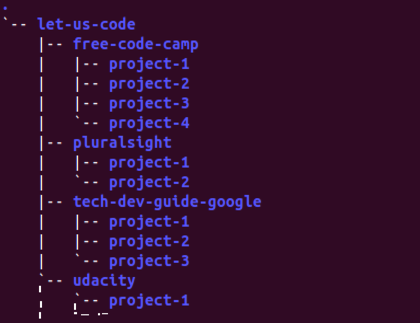

# Let's Code
This repository contains my personal projects. The projects have been further categorized on the basis of *source* from which the idea has been taken. The folder structure and the *naming* convention applied are as shown below: 

- The names are *specific* and consists of *minimal* set of *related* and *meaningful* words.  
- All the words within name are in *lowercase* and separated by *hyphen*.

Note: Each project has a separate README file with proper citations and references to the resources.
### List of Projects
- udacity-front-end-web-development-nanodegree/neighborhood-map

### Feedback
Contributions are always *welcome*. Please send your feedback at <amitananddotxyz@gmail.com>.

### License
This project is licensed under the GNU General Public License v3.0 - see the LICENSE.md file for details.
